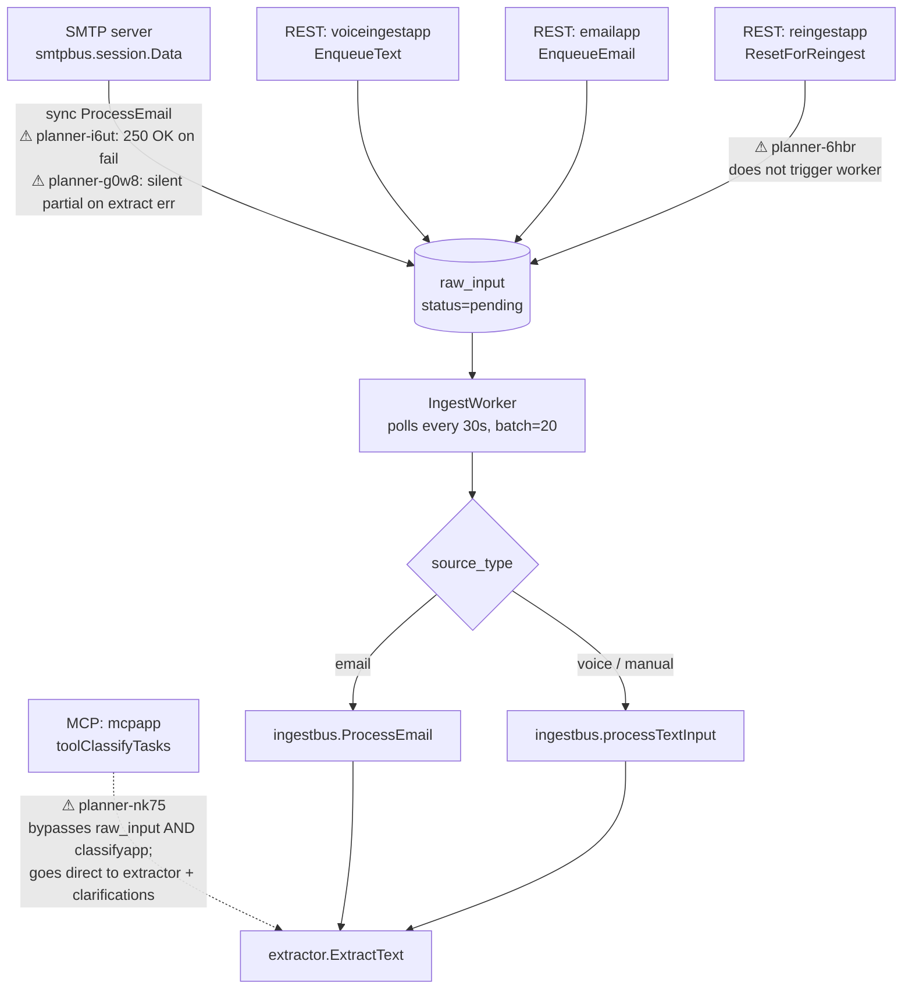
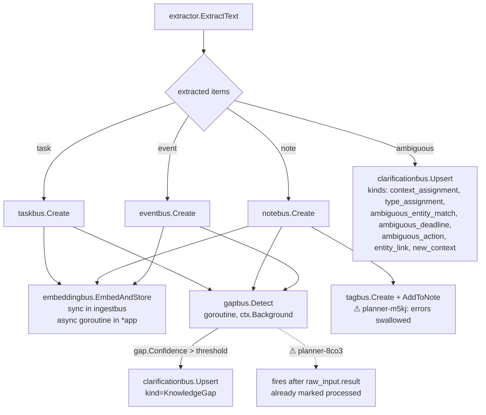
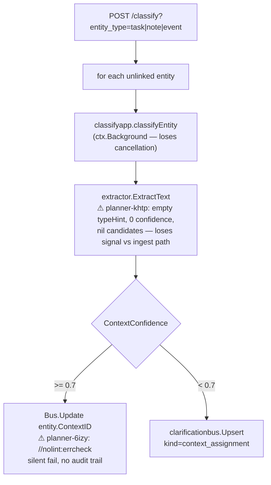
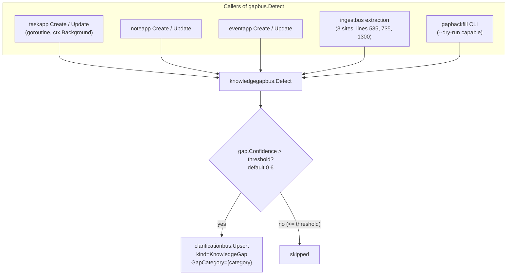
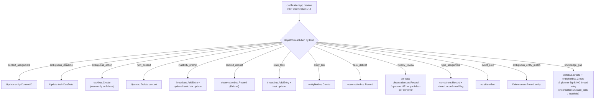

# Ingestion → Classification → Clarification: Flow Trace

Traces external inputs through the ingestion, classification, knowledge-gap, and clarification pipelines. Documents what the code actually does (which sometimes diverges from what per-domain arch docs imply).

Every ⚠ callout maps to a beads issue listed in [§8](#8-open-issues).

## 1. External Entry → Raw Input

**Notes:**
- SMTP is the only entry point that runs the pipeline synchronously inside the request.
- `EnqueueText` / `EnqueueEmail` return the `raw_input` ID immediately and rely on the worker.
- MCP `toolClassifyTasks` is a separate code path that does not touch `raw_input` and does not invoke `classifyapp` — it calls `extractor.ExtractText` directly and writes clarifications by hand.
- Reingest does not push the worker; it just resets `raw_input.status=pending` and waits for the next 30 s poll.

## 2. Extraction → Entity Creation

## 3. Classifier (post-hoc linker)

`classifyapp` runs after extraction has already produced entities. It is invoked manually to link existing **unlinked** tasks/notes/events to a context. It is *not* the same path as ingestion-time extraction — they share the extractor but pass different arguments.

The high-confidence path produces zero audit trail (no correction record, no log on Update failure). The low-confidence path produces a clarification card; when the user answers it, `correctionBus.Record` runs with `source=clarification_answered`.

## 4. Knowledge Gap (gapbus)

There is **no `gap` table**. `gapbus.Detect` writes clarifications dimensioned by `GapCategory`. Repeated calls with the same category re-update the single card via the unique constraint `(kind, subject_type, subject_id, gap_category)`.

## 5. Clarification Resolution Dispatch

`clarificationapp.dispatchResolution` switches on `Kind`. Every branch has its own side-effect set; some branches write multiple domains.

## 6. Side-Effect Domains: Who Writes

| Domain | Auto-write triggers | Sync? | Errors |
|---|---|---|---|
| **embedding** | task/note/event Create (async goroutine in *app); ingestbus 6 sites (sync) | mixed | logged, best-effort |
| **observation** | clarificationapp resolve (context_debrief, task_debrief, weekly_review); mcpapp | sync | swallowed (loop continues for weekly_review — planner-921m) |
| **entitylink** | clarificationapp resolve (entity_link, knowledge_gap); direct API | sync | swallowed (warn) |
| **tag** | ingestbus note creation; mcpapp note creation | sync | **swallowed silently — no log** (planner-m5kj) |
| **activitylog** | mcpapp task complete | sync | swallowed (warn) |
| **thread** | task/event Create (system entry); inactivity_prompt / stale_task resolution | sync | varies |
| **correction** | reclassifybus (in tx); correctionapp (non-tx, planner-ykh0); type_assignment resolve | sync | partial on failure in correctionapp |

## 7. Reclassify vs Correction (same user-facing op, different DB outcomes)

| Aspect | `reclassifybus` | `correctionapp` |
|---|---|---|
| Transaction boundary | explicit BEGIN/COMMIT, full rollback | **none** — separate `Create` + `Delete` round-trips |
| `RawInputID` | preserved | **dropped** (planner-hurd) |
| Correction record | `RecordWithTx` in transaction | non-fatal `Record` (logged, not propagated) |
| Preflight checks | none in bus | none |

A failed `correctionapp` conversion can leave an **orphan entity** (Create succeeded, Delete failed → 2 entities) or a **lost original** (Delete succeeded, Create failed → 0 entities). `reclassifybus` is consistent because everything is in one tx.

## 8. Open Issues

| ID | Priority | Summary |
|---|---|---|
| planner-nk75 | P1 | MCP `toolClassifyTasks` bypasses classification bus and rawinput |
| planner-i6ut | P1 | SMTP returns 250 OK even when ingestion pipeline fails |
| planner-g0w8 | P1 | `ProcessEmail` marks partial + returns nil after extraction error |
| planner-ykh0 | P1 | `correctionapp` converts entities non-transactionally |
| planner-8co3 | P1 | Gap detection runs after `raw_input.result` already marked processed |
| planner-hurd | P2 | `correctionapp` drops `RawInputID` on conversion |
| planner-khtp | P2 | `classifyapp` passes empty type hints to extractor |
| planner-6izy | P2 | `classifyapp` Update errors silently swallowed via `//nolint:errcheck` |
| planner-5gr8 | P2 | `knowledge_gap` clarification resolution writes no thread entry |
| planner-921m | P2 | `WeeklyReview` observation loop continues on per-iteration error |
| planner-6hbr | P2 | Reingest API does not trigger ingest worker |
| planner-m5kj | P3 | Tag `Create` / `AddToNote` errors silently swallowed |

## 9. Noted but not filed

- `classifyapp` goroutines use `ctx.Background` — loses request cancellation (broader pattern in the codebase, not specific to this flow).
- MCP `extractor.ContextRef` constructed without `Kind` field — subset of planner-nk75.
- `clarificationbus.Upsert` silently drops `SuppressUntil` from `NewClarificationItem` input — minor.
- High-confidence classify produces no audit trail — covered by planner-6izy.
- Reingest dismisses clarifications even when `skip_classify=true` — subset of planner-6hbr.
